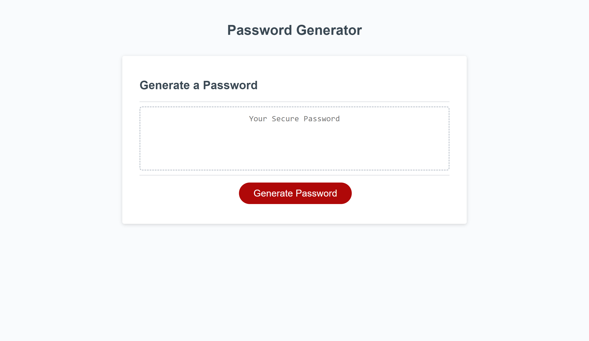

# Random Password Generator

## Description
The following application produces a customized password, based on the user's selection of a number and type of characters. This application has been designed to create a password between 8-128 characters. Also, a series of prompts are displayed to the user asking for the preference of the characters that will be included inside their password. 

The application is easy to navigate and if the user makes a mistake, a window alert will be displayed with the information on how to enter the information correctly.

This style of application is handy when it comes to handling sensitive information and large volumes. It will speed the process and ensure a certain level of safety.

-------------------

## Instructions
1. Click on the provided URL for the deployed site.
2. Click on "Generate Password".
3. Enter the desired length of the password (between 8-128 characters).
4. Select the character types that are desired in said password: 
   
    - Numeric characters.
    - Lower case characters.
    - Upper case characters.
    - Special characters.

Note: at least one type of character needs to be selected.

5. Copy your password from the input box.

## Installation

N/A

--------------------

## Submission Links

### Deployed URL: https://momoncada.github.io/password-generator-moncada/

### GitHub: https://github.com/MoMoncada/password-generator-moncada

---------------------

## Deployed Web Page

## Credits
Maria Auxiliadora Moncada 

------------

## License
N/A
